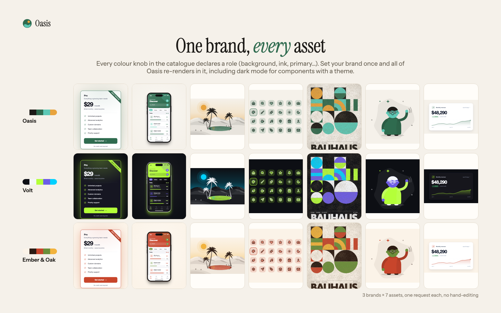
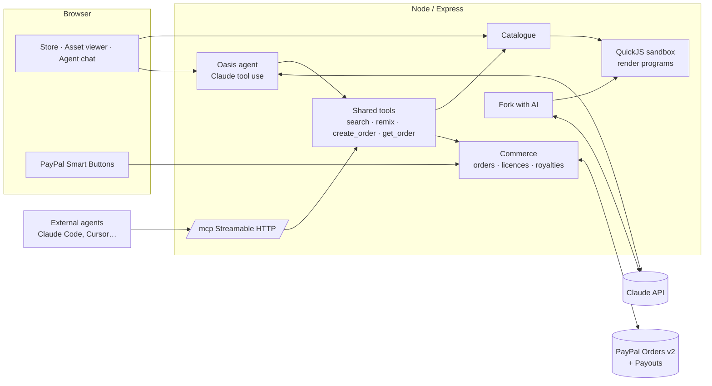

# Oasis: assets your agent can brand and buy

**Design assets built as tiny programs.** Every icon set, UI kit, mockup, poster, illustration and isometric town on
Oasis is a small program with typed knobs. Set your brand once and the whole catalogue re-renders in it. Brief the
Oasis agent (or any agent over MCP) and it builds a branded kit, then opens a PayPal order that only a human can
approve. Forks pay royalties upstream through PayPal Payouts.

Built for the [PayPal AI Hackathon](https://paypalaihackathon.devpost.com/).
Live: **https://oasis-design.onrender.com** · PayPal walkthrough for developers: **[PAYPAL.md](PAYPAL.md)**



---

## Why

Stock design assets are frozen files. You buy an illustration, and then it's the wrong teal, the wrong
proportions, and it says "Lorem ipsum". Designers either settle or redraw it.

Oasis sells assets as **programs**. A pricing card has knobs for plan name, price, theme, accent, radius, feature
rows. An icon set has stroke, style, container and line caps. A mesh gradient has a seed and four colours. You
turn the knobs until it's *yours*, and you license *that*.

The idea comes from [Polyfork](https://polyfork.dev), Lucas Martinic's store of 3D models sold as programs (winner
of the Build with Gemini XPRIZE). Oasis carries it into product design, UI design and graphic design, and adds two
things Polyfork doesn't do: an **agent that shops for you** and **royalty-paying forks**.

## What you can do

| | |
|---|---|
| **Browse & remix** | 40+ assets across UI, mockups, icons, posters, patterns, illustration, brand and avatars. Colourway presets, live knobs, "surprise me", shareable remix links. |
| **License with PayPal** | PayPal Smart Buttons check out a cart of remixes; prices are re-validated server-side. Paid previews are watermarked until licensed. |
| **Download any format** | SVG, 2048px PNG, React component, CSS class, and the **source program itself**, so you can keep remixing forever. |
| **Brief the agent** | Describe your brand and deliverables. Claude searches, remixes every piece into one palette, *looks at each render* and fixes what's off, fills the cart, and opens a PayPal order. You approve the payment; the agent never can. |
| **Fork with AI** | Describe a new direction ("make it art deco"). Claude rewrites the program, the sandbox proves it renders, and it's published as a new asset with lineage. |
| **Royalties** | Each licence splits revenue: 60% fork creator, 30% upstream ancestors, 10% platform. Creators with a PayPal email are paid via **PayPal Payouts** the moment the order is captured. |
| **Agent commerce over MCP** | `POST /mcp` exposes `search_assets`, `get_asset`, `remix_asset`, `create_order`, `get_order`. Any agent (Claude Code, Cursor…) can shop; the human approves in PayPal; the agent gets download links. |

## How PayPal is used

- **Orders v2** through the official [`@paypal/paypal-server-sdk`](https://www.npmjs.com/package/@paypal/paypal-server-sdk)
  (`OrdersController.createOrder` / `captureOrder`), itemised as `DIGITAL_GOODS`, with `NO_SHIPPING` and a
  `PAY_NOW` experience context. Structure follows PayPal's own reference server,
  [`paypal-examples/docs-examples` → `standard-integration/server/node/server.js`](https://github.com/paypal-examples/docs-examples/blob/main/standard-integration/server/node/server.js).
- **JS SDK Smart Buttons** on the asset page, cart, and inside the agent chat (`createOrder` → `onApprove` → server
  capture, including the `INSTRUMENT_DECLINED` → `actions.restart()` path from the same reference client).
- **Agent-created orders** carry a `return_url`, so an MCP agent can hand a human the `payer-action` link; the
  return route captures, and `get_order` returns licences.
- **Payouts API** (`/v1/payments/payouts`) pays fork creators and their ancestors their royalty split.
- Tool names for agents mirror PayPal's own [agent toolkit](https://github.com/paypal/agent-toolkit)
  (`create_order`, `get_order`).

## How AI is used

- **The Oasis agent** (`server/agent.js`): Claude Opus 5.5 with tool use: search, read schemas, remix, add to cart,
  create order, fork. Every remix returns a rendered PNG *to the model*, so it critiques its own output (contrast,
  clipping, clashing colours) and remixes again. History is kept server-side, append-only.
- **Fork with AI** (`server/fork.js`): Claude rewrites an asset program to a new creative direction; the result must
  load and render inside the sandbox before it's published.
- **The asset factory** (`factory/factory.mjs`): how most of the catalogue was made: Claude writes a program from a
  one-line brief, the sandbox renders it at defaults, presets and every range maxed, then Claude *looks at those
  renders* as a design director and revises. (Polyfork's equivalent publishes 175+ models a week.)

## Safety

Asset programs, including AI-written forks, run in **QuickJS compiled to WebAssembly** (`server/sandbox.js`): no
`require`, no filesystem, no network, a 48 MB memory cap and a hard time limit. Output must be an `<svg>` string,
and the browser only ever shows it through ``, where SVG scripts cannot run. Paid program source never leaves the server.

## Architecture



## The asset format

One self-contained ES module (full contract: [`factory/CONTRACT.md`](factory/CONTRACT.md)):

```js
export const meta = { title, kind, description, tags, price, author, size };
export const params = {
  knobs: { accent: { type: "color", default: "#5B5CF0" }, rows: { type: "range", default: 5, min: 3, max: 6, step: 1 }, … },
  presets: { Emerald: { accent: "#10A37F" }, … },
};
export default function render(p) { return `<svg …>…</svg>`; }
```

The knob schema follows Polyfork's (`type: color | range | choice | toggle`, `label`, `default`, `min/max/step`,
`options`, named colourway presets), as read in
[`polyfork-unity-connector/Runtime/PolyforkKnob.cs`](https://github.com/lucas-martinic/polyfork-unity-connector/blob/main/Runtime/PolyforkKnob.cs).
Oasis adds a `text` type, because design assets carry words (headlines, labels, names) where 3D models don't.

## Run it

```bash
git clone https://github.com/machmoon/oasis && cd oasis
npm ci
cp .env.example .env   # add PayPal sandbox client id/secret and an Anthropic API key
npm start              # http://localhost:8787
```

- Sandbox buyer: log in to the PayPal popup with any sandbox *personal* account from
  developer.paypal.com → Testing tools → Sandbox accounts.
- Connect an agent: `claude mcp add --transport http oasis http://localhost:8787/mcp`
- Grow the catalogue: `npm run factory` (reads `factory/briefs.json`), review with `npm run sheet`.

## Credits

- Concept: [Polyfork](https://polyfork.dev) by Lucas Martinic (assets as programs, typed knobs, agent-native store).
- Icon glyphs: [Lucide](https://github.com/lucide-icons/lucide) (ISC).
- Beam avatars: layout from [boring-avatars](https://github.com/boringdesigners/boring-avatars) `avatar-beam.tsx` (MIT).
- Blob geometry: [g-harel/blobs](https://github.com/g-harel/blobs) `internal/gen.ts` (MIT).
- PayPal checkout structure: [paypal-examples/docs-examples](https://github.com/paypal-examples/docs-examples).
- MCP server: [modelcontextprotocol/typescript-sdk](https://github.com/modelcontextprotocol/typescript-sdk) stateless Streamable HTTP example.

MIT licensed.
