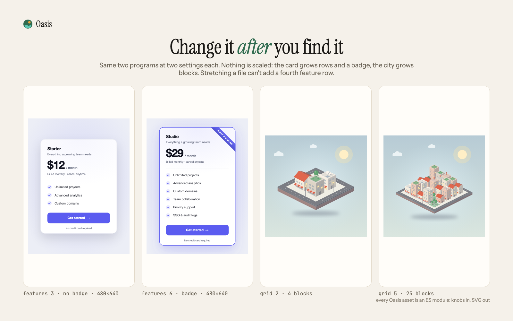
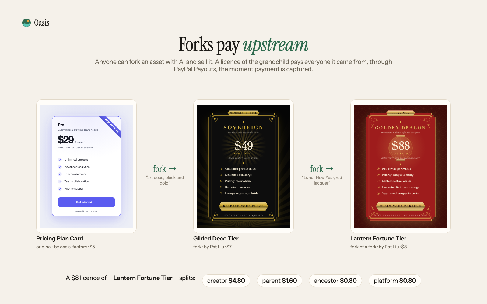

# Oasis

**Tagline:** Design assets your AI agent can reshape, brand and buy. Every icon set, UI kit, poster and illustration is a little program; PayPal lets an agent pay for one with a human's approval.

<!-- Numbers in {{braces}} are filled from factory/stats.jsonl, /api/stats and real PayPal sandbox runs before submitting. Nothing here is estimated. -->

## Inspiration

Interfaces are increasingly built by agents. You describe a product to Claude, v0 or Lovable and a working UI comes
back in a minute. The code part of that loop is solved. The *design* part is not: the moment the agent needs a hero
illustration, an icon set, a pricing card or an app icon, it falls off a cliff.

It has two bad options. It can generate an image, which arrives with no licence, in the wrong colours, and different
every time. Or it can use a stock asset, which is a frozen file someone else finished. The illustration is the wrong
teal, the card has three feature rows when you need five, the poster says "Lorem ipsum". A person opens Figma and
fixes it. An agent can't.

And even when the agent finds the right asset, it can't buy it. Stock sites are built for a human with a card in a
checkout form. An agent that's allowed to spend your money is exactly what nobody should build.

Polyfork showed the way out for 3D: sell models as programs, not meshes. I think design needs the same thing, plus
two pieces 3D didn't: **brand** (every asset a team uses has to be in *their* colours) and **payment an agent can
initiate but a human approves**. That second piece is what PayPal's order-approval flow already is.

## What it does

**Oasis is a store of design assets where nothing is finished.** Every asset is an ES module: typed knobs in, SVG out.

The pricing card above is one program at two settings. It isn't stretched: the card grows three more feature rows
and a badge. The city isn't scaled: it grows from 4 blocks to 25. A file can't do either.

**Brand Mode.** Every colour knob in the catalogue declares a role: background, surface, ink, muted, primary,
secondary, highlight. Set your brand once and *every asset in Oasis* re-renders in it. Components with a light/dark
theme follow the brand's darkness on their own.

**The Oasis agent.** Describe your product and what you need ("a calm meditation app, deep teal and coral: app icon,
hero background, pricing card, testimonial avatars, under $20"). Claude searches the catalogue and sets one brand
across every piece. It **looks at each render it makes** and remixes again when something is off, then fills a cart
and opens a **PayPal order**. You approve it in PayPal's own window. The agent can't pay; it can only ask.

**Agents outside Oasis can shop too.** One MCP endpoint (`/mcp`, no key to browse) exposes `search_assets`,
`get_asset`, `remix_asset` (returns the render so the agent can judge it), `create_order` (returns PayPal's approval
link for the human) and `get_order` (captures and returns licensed downloads). Tool names follow PayPal's own agent
toolkit.

**Forks pay upstream.** Anyone can fork an asset with AI ("make it art deco"). Claude rewrites the program, and the
sandbox and harness prove it renders. Then it's published with its lineage. Every licence of a fork pays its creator
60%, its ancestors 30% and Oasis 10%, through **PayPal Payouts** the moment the payment is captured.

**What you download.** The exact remix as SVG, a 2048 px PNG, a React component, a CSS class, or the program itself,
so you can keep turning knobs forever.

## How we built it

**PayPal, end to end.**
- Orders v2 through `@paypal/paypal-server-sdk`: itemised `DIGITAL_GOODS`, `NO_SHIPPING`, `PAY_NOW`, and return/cancel
  URLs so an MCP agent can hand a human the `payer-action` link.
- Smart Buttons in the asset page, the cart and inside the agent chat.
- Capture is server-side only. Licences are issued only if the captured amount and currency equal what the server
  priced; a mismatch is refunded automatically.
- `PayPal-Request-Id` idempotency keys on create, capture and refund. A per-order capture lock, because the browser,
  the return URL and a webhook can race.
- Webhooks are verified with `verify-webhook-signature`: `CHECKOUT.ORDER.APPROVED` captures orders whose tab closed,
  `PAYMENT.CAPTURE.REFUNDED` revokes licences, and `PAYMENT.PAYOUTS-ITEM.*` tracks every royalty.
- Payouts for royalties; buyer refunds within 14 days through the Payments API.
- Real sandbox runs: {{orders}} orders captured, {{payouts}} royalty payouts sent, {{refunds}} refunds.

**The asset factory.** Most of the catalogue was written by an agent pipeline I supervise, and none of it ships on
the builder's word:
1. Claude writes a program from a one-line brief, renders it and critiques its own renders as a design director.
2. **A harness measures it and contradicts the builder.** It renders every asset {{renders_per_asset}} times: defaults,
   every preset, all ranges at min and max, random knob combinations, and a light and a dark brand. It rejects
   blank output, slow renders, oversize SVG and, most often, *dead knobs*: a knob whose every value produces
   byte-identical SVG.
3. **An independent grader in a fresh session**, which never saw the builder's reasoning, scores craft, range,
   usefulness and knob design, and rejects anything below 7. It rejected {{grader_reject_rate}} of first submissions.
4. Every grader verdict writes one *general* lesson into the builder's prompt. {{lessons}} lessons so far; each build
   reads all of them.

Factory v1 results, measured: of the first 40 assets, 18 passed the harness as written. The harness found
{{dead_knobs_found}} dead knobs that the builder's own review had approved.

**Safety.** Asset programs, including AI-written forks, run in QuickJS compiled to WebAssembly: no `require`, no file
system, no network, a 48 MB heap, a 1.5 s interrupt. Because an allocation storm can outrun QuickJS's own interrupt,
every server render also runs in a worker thread that's terminated at 3 s. Output must be SVG and is only shown
through ``, where scripts can't run. Paid program source never leaves the server; catalogue previews are low-res
raster comps, and full-resolution vectors are watermarked until licensed.

**Stack.** Node + Express, a no-build vanilla JS store, Claude Opus 5.5 (agent, forks, factory, grader), MCP
Streamable HTTP, resvg for rasterising, Playwright for figures and video, Render for hosting. {{tests}} tests cover
knob validation, royalty arithmetic (every cent accounted for along a fork chain), sandbox escapes and the deadline
kill.

## Challenges we ran into

- **The builder agent approves its own dead knobs.** The first catalogue looked great in review. The harness found
  that 22 of 40 assets had at least one knob that changed nothing, often a text field the layout never printed. Since
  then, "every knob must change the bytes" is a hard gate, not a review question.
- **A memory bomb beat the sandbox's own clock.** `while (true) a.push('x'.repeat(1e6))` took 8.3 s to die inside
  QuickJS, because allocation thrash starves the interrupt check. The fix was to enforce the deadline from outside,
  by terminating the worker thread.
- **Brand Mode on dark brands.** Mapping colours by role made every light component unreadable on a black brand
  until components with a theme switch were taught to follow the brand's background luminance.
- **Royalties in cents.** Splitting 30% of $7.99 across a parent and two grandparents has to sum to exactly 799 cents
  every time. It's tested.

## Accomplishments that we're proud of

- An agent that goes from a one-paragraph brief to a coherent, branded, *paid-for* kit, and that threw away its own
  muddy first renders without being asked.
- A fork of a fork that pays three parties automatically.
- {{assets}} assets, {{knobs}} typed knobs, every colour knob brand-aware.

## What we learned

- Agents need assets that are **code** for the same reason Polyfork found: a planner can read, diff and change one
  line of a program. Design adds a second reason: a program can take a brand as input. A file can't.
- **Measure the artefact, not the agent's description of it.** Every quality jump came from a check that rendered
  the program and counted something.
- For agentic commerce the right primitive is not "agent has a card". It's "**agent creates an order, human
  approves**", and PayPal's order approval already works that way.

## What's next

- PayPal Commerce Platform onboarding for creators, so royalty splits settle at capture instead of via Payouts.
- PayPal Subscriptions for an all-access plan.
- A Figma plugin and a `npx oasis add pricing-card --brand ./brand.json` CLI, so assets install like packages.
- Scale the factory with parallel lanes and themed kits (onboarding, dashboards, commerce) that share one layout grid.

## Built with

paypal-orders-v2 · paypal-js-sdk-smart-buttons · paypal-payouts · paypal-webhooks · paypal-payments-refunds ·
claude-opus-5-5 · anthropic-sdk · model-context-protocol · quickjs-wasm · node.js · express · svg · resvg ·
playwright · render

## Try it

- Live: {{live_url}}
- MCP: `claude mcp add --transport http oasis {{live_url}}/mcp`
- Code: https://github.com/machmoon/oasis

## PayPal developer feedback

- The server SDK has no Payouts or Webhooks controllers, so royalties and webhook verification needed hand-rolled
  OAuth and REST calls next to the SDK.
- Orders created with `payment_source.paypal.experience_context` return a `payer-action` link, while older
  `application_context` orders return `approve`. Agents need one stable link name to hand to a human.
- Agentic commerce would benefit from a first-class "order created on behalf of an agent" marker shown in the
  approval UI, so the buyer sees which agent asked.
